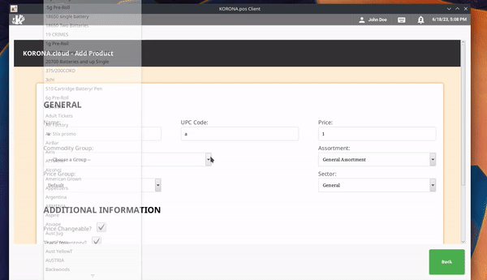
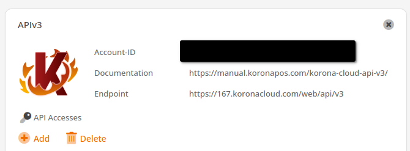
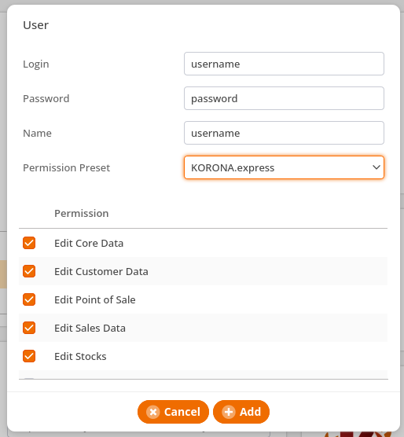
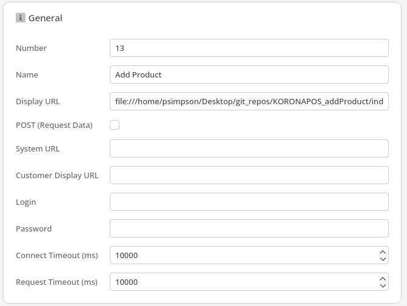
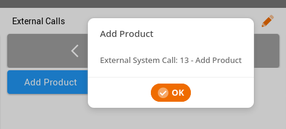

<h1>KORONA POS - Add Product (External System Call)</h1>

 The following is a template we used to create a 'Quick Add' button within the KORONA POS system. Users can add the path of the index.html file as a 'Display URL' in External System Call under the Settings section in their Korona.cloud account. 

    <a href="">APIv3 Documentation</a>

<h2>Setup</h2>

<ol>
    <li>
        <h3>Add the APIv3 widget</h3>
        
Under Settings, click 'Data Exchange'. In the input area, type in 'APIv3'. You should see the '+Add' button turn bright orange. Click it. Now you should see an APIv3 widget with the following areas: Account-ID, Documentation, and Endpoint

            
    </li>
    <li>
        <h3>Add User Credentials</h3>
        
Toward the middle left of the widget, under 'API Accesses', click the 'Add' button. This will display a modal in which you can add a new user for the endpoint. Make sure to enter a Login, Password, and Name. Select 'Korona.express' if you would like them to have full access to your account.

            
    </li>
    <li>
        <h3>Creating the External System Call</h3>
        
Under 'Settings' select 'External System Calls', then 'New'. Give it a name, and place the file location of the index.html within the 'Display URL' input. Click 'Save' at the top.

            
    </li>
    <li>
        <h3>Creating the Button</h3>
        
Under 'Settings' select 'Button Configurations', then select the appropriate layout (most likely - 'Default Configuration Layout'). Next select the button layout page you would like to add the new button to (For Example: Quick Keys) by clicking on the orange pencil located to the right of the given layout section.

         
        
Next click on any open space within the button layout. At the far left of the page, click on 'Add Function'. Select a type of 'External System Call', and select the call we just created. Click 'Save' at the top of the page.

         
        
Finally, Retrieve Master Data at the POS, and you're all set! Happy Adding!

            
    </li>
</ol>
